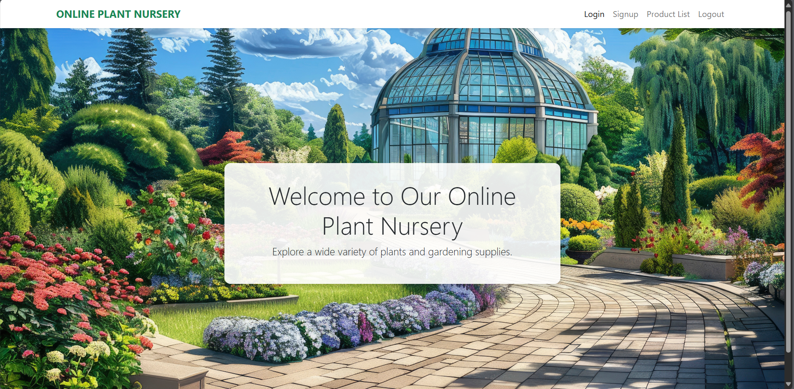
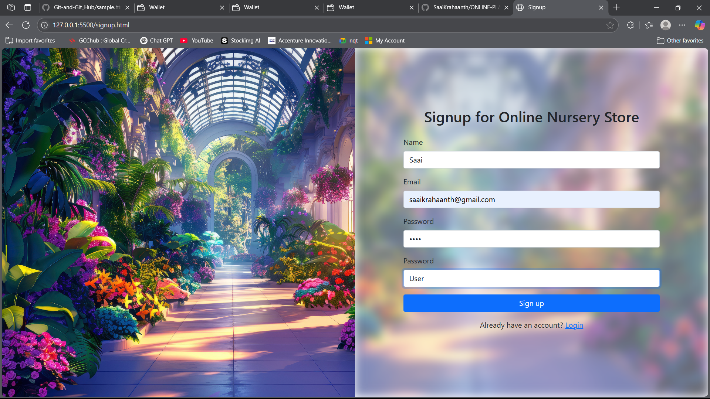
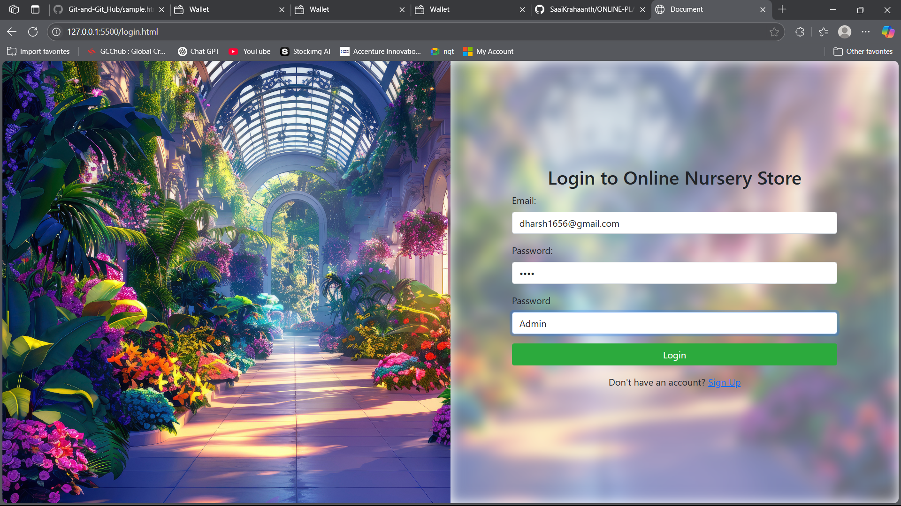
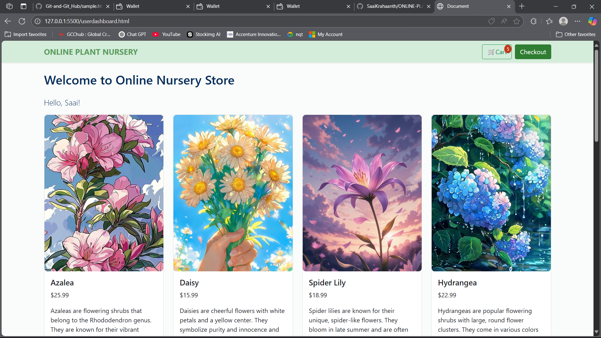

# 🌿 ONLINE PLANT NURSERY WEBSITE

A beginner-friendly plant e-commerce website built using **HTML**, **CSS**, and **JavaScript**, featuring both **admin and user login** functionality.

🔗 **Live Site:** [saaikrahaanth-online-plant-nursery.netlify.app](https://saaikrahaanth-online-plant-nursery.netlify.app/)

---

## 🚀 Features

- 🔐 User Signup & Login
- 🧾 Checkout Flow
- 🧑‍💼 Admin Dashboard for Product Management
- 🌱 Product Listing
- 🎨 Clean UI with basic validations

## 📸 Screenshots

### 🏠 Home Page


### 👤 User Signup


### 🔐 Admin Login


### 🧾 Product List (Admin View)


## 📁 Project Structure

| File/Folder            | Description                            |
|------------------------|----------------------------------------|
| `index.html`           | Home page                              |
| `login.html`           | User/Admin login page                  |
| `signup.html`          | User registration page                 |
| `logout.html`          | Logout logic                           |
| `userdashboard.html`   | Dashboard for logged-in users          |
| `admin-dashboard.html` | Dashboard for admins                   |
| `add-product.html`     | Admin - Add new product                |
| `productlist.html`     | Admin - View all products              |
| `checkout.html`        | Checkout summary page                  |
| `product.json`         | JSON-based product data storage        |
| `style.css`            | CSS styling                            |
| `js/`                  | JavaScript functionality               |
| `PHOTOS/`              | Assets (product images, etc.)          |
| `SCREENSHOTS/`         | App interface screenshots              |

## 🛠️ Tech Stack

- HTML5
- CSS3
- JavaScript (Vanilla)
- LocalStorage / JSON file for mock data


## 🧪 How to Run

1. Clone the repository:
   ```bash
   git clone https://github.com/SaaiKrahaanth/ONLINE-PLANT-NURSERY-WEBSITE.git
   cd ONLINE-PLANT-NURSERY-WEBSITE


2. Open `index.html` using **Live Server** (VSCode extension) or any modern browser.

> ⚠️ **Note:** If you're using `product.json`, it won't load properly when opening via `file://`. Use a local server like Live Server to avoid CORS (Cross-Origin Resource Sharing) issues.

---

## 🙏 Acknowledgement

Thanks to **CTS Training** for guiding and inspiring the development of this mini-project.
